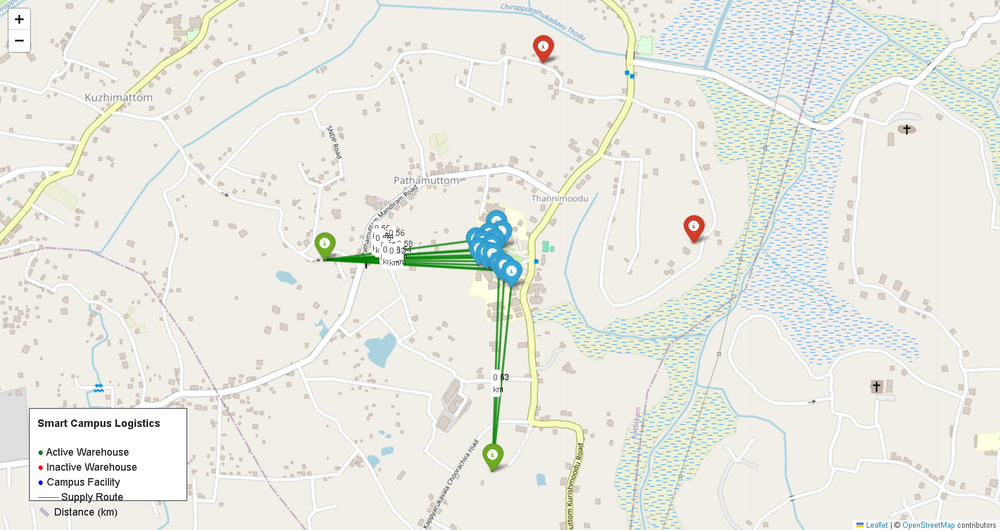

# Smart Campus Logistics Optimization

A data-driven system that optimizes emergency supply distribution across a university campus using operations research techniques.

This project uses mathematical optimization to determine the best warehouse locations and supply routes so that campus facilities receive resources efficiently while minimizing operational cost.

---

# Problem Statement

Large campuses contain many facilities such as academic blocks, laboratories, event spaces, and service areas. These locations require a continuous supply of essential resources such as food, medicine, and water.

Manual logistics planning can lead to:

- inefficient resource allocation  
- higher transportation costs  
- delays in delivery  
- lack of redundancy during emergencies  

To address this problem, this project builds an **optimization model** that automatically determines the most efficient logistics configuration.

---

# Project Goals

The system determines the optimal warehouse selection and supply distribution plan that:

- minimizes total annual logistics cost
- satisfies demand at all campus facilities
- respects warehouse capacity constraints
- ensures redundancy through multiple warehouses
- operates within the available logistics budget

---

# Dataset Overview

## Campus Facilities

The optimization model considers several important campus locations.

| Facility | Type | Daily Demand |
|--------|------|-------------|
| RB Block | Academic | 45 |
| VB Block | Academic | 40 |
| CLC Block | Academic | 35 |
| AB Block | Academic | 42 |
| North Block | Academic | 38 |
| South Block | Academic | 36 |
| Amenity Block | Essential | 50 |
| AK Block | Academic | 37 |
| Mini Auditorium | Event | 30 |
| Amphitheatre | Event | 28 |
| Central Complex | Essential | 55 |
| Engineering Labs | Critical | 48 |
| Main Entry | Logistics | 25 |

Each facility has an estimated **daily resource demand**.

---

## Warehouse Locations

Four possible warehouse locations are evaluated.

| Warehouse | Capacity | Construction Cost | Operational Cost / Day |
|----------|----------|------------------|------------------------|
| WH_NORTH | 420 | $310,000 | $850 |
| WH_SOUTH | 380 | $295,000 | $780 |
| WH_EAST | 450 | $330,000 | $910 |
| WH_WEST | 400 | $305,000 | $820 |

The optimization model automatically selects the best warehouse combination.

---

# Optimization Model

The logistics network is formulated as a **Mixed Integer Linear Programming (MILP)** problem.

The model determines:

- which warehouses should be activated
- how resources should be distributed
- the most cost-efficient supply network

---

## Decision Variables

| Variable | Type | Description |
|--------|------|-------------|
| Warehouse Activation | Binary | Indicates whether a warehouse is selected |
| Shipment Quantity | Continuous | Quantity shipped from warehouse to facility |

---

## Objective

The system minimizes total annual logistics cost including:

- warehouse construction cost
- warehouse operational cost
- transportation cost based on geographic distance

---

# Optimization Results

After solving the model, the system identifies the most efficient logistics configuration.

## Selected Warehouses

| Warehouse | Selected |
|----------|----------|
| WH_SOUTH | Yes |
| WH_WEST | Yes |
| WH_NORTH | No |
| WH_EAST | No |

These warehouses provide the most cost-efficient distribution network.

---

## Example Distribution Plan

| Warehouse | Facility | Annual Units |
|----------|----------|--------------|
| WH_SOUTH | RB Block | 16,425 |
| WH_SOUTH | VB Block | 14,600 |
| WH_SOUTH | AB Block | 15,330 |
| WH_WEST | Central Complex | 20,075 |

The model distributes supplies to all facilities while satisfying demand constraints.

---

# Visualization

The system generates a geographic map showing:

- campus facilities
- selected warehouses
- optimized supply routes
- distance between locations

Example output:



---

# Technologies Used

| Technology | Purpose |
|-----------|--------|
| Python | Core programming language |
| Pandas | Data processing |
| PuLP | Optimization modelling |
| CBC Solver | Linear programming solver |
| Folium | Interactive map visualization |
| LaTeX | Academic report preparation |

---

# Project Structure
Micro-project
│
├── data
│ ├── facilities.csv
│ ├── warehouses.csv
│ ├── transport_costs.csv
│ └── travel_time.csv
│
├── src
│ └── optimize_network.py
│
├── campus_map.png
├── main.tex
└── README.md


---

# Running the Project

## Install Dependencies

```bash
pip install pandas pulp folium
```
---
Run Optimization
```bash
python optimize_network.py
```

---
